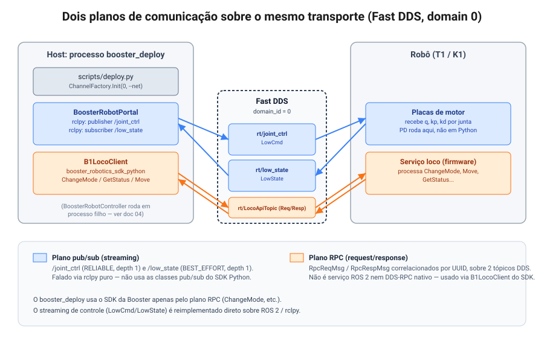

# 1. Arquitetura de comunicação: pub/sub vs. RPC

> Referência: commit `0dba32b` (branch `tsinghua`). Repositórios: `booster_deploy` e
> `booster_robotics_sdk`.

## Resposta direta

A comunicação com o robô real **não** é puramente ROS 2/pub-sub, mas também não é um RPC
"clássico" (gRPC, DDS-RPC, serviço ROS 2). É um sistema híbrido, com **dois planos de
comunicação** rodando sobre o mesmo barramento Fast DDS, no mesmo domínio (`domain_id = 0`):

| Plano | Mecanismo real | Tópicos | Para quê |
|---|---|---|---|
| **Streaming (pub/sub)** | Fast DDS puro, falado via `rclpy` | `/joint_ctrl` (escrita), `/low_state` (leitura) | Comando de juntas e telemetria a alta frequência |
| **RPC** | Request/response caseiro, **também implementado como dois tópicos DDS** | base `rt/LocoApiTopic` (+ sufixos de request/response) | Troca de modo, comandos de alto nível, consultas de status |

O `booster_deploy` usa **os dois**, mas por caminhos de código diferentes: o loop de controle
fala DDS diretamente via `rclpy`; a troca de modo fala com o SDK da Booster
(`booster_robotics_sdk_python`), que por sua vez usa RPC-sobre-DDS internamente.



## Plano 1 — Streaming pub/sub

O `booster_deploy` **não usa** as classes de pub/sub do SDK Python (`B1LowCmdPublisher`,
`B1LowStateSubscriber`). Ele fala ROS 2 diretamente com `rclpy`, usando o pacote de mensagens
`booster_interface.msg`:

```python
# booster_deploy/controllers/booster_robot_controller.py:12-15
import rclpy
from rclpy.executors import SingleThreadedExecutor, ExternalShutdownException
from rclpy.qos import QoSProfile, ReliabilityPolicy, HistoryPolicy
from booster_interface.msg import LowState, LowCmd, MotorCmd
```

Isso funciona porque o SDK usa Fast DDS por baixo (vendorizado como `booster_eprosima`,
`booster_robotics_sdk/include/booster_fastdds/`), e os tópicos DDS nativos da Booster
(`rt/joint_ctrl`, `rt/low_state`) usam exatamente o prefixo `rt/` que o ROS 2 usa para
"mangling" de nomes de tópico. Ou seja, `/joint_ctrl` em `rclpy` e `rt/joint_ctrl` no SDK C++
são o **mesmo tópico DDS**, desde que estejam no mesmo `domain_id` (0, em ambos os casos —
`scripts/deploy.py:66` e todos os exemplos do SDK).

### Publicação de comando — `/joint_ctrl`

```python
# booster_deploy/controllers/booster_robot_controller.py:267-277
publisher = self.publish_node.create_publisher(
    LowCmd,
    "joint_ctrl",
    QoSProfile(
        depth=1,
        reliability=ReliabilityPolicy.RELIABLE,
        history=HistoryPolicy.KEEP_LAST
    )
)
```

- QoS **RELIABLE**, profundidade 1: a última mensagem é reentregue se um assinante conectar
  atrasado, mas não há fila de histórico.
- `LowCmd.cmd_type = LowCmd.CMD_TYPE_SERIAL` (`:282`) — ver [04](04-mapa-do-framework.md) para
  a diferença entre `SERIAL` e `PARALLEL` (tornozelo).
- Um `MotorCmd` por junta, com `q, dq, tau, kp, kd, weight` — ver
  [03](03-ganhos-pd-sim-vs-real.md).

### Assinatura de estado — `/low_state`

```python
# booster_deploy/controllers/booster_robot_controller.py:176-185
low_state_node.create_subscription(
    LowState,
    "/low_state",
    self._low_state_handler,
    QoSProfile(
        depth=1,
        reliability=ReliabilityPolicy.BEST_EFFORT,
        history=HistoryPolicy.KEEP_LAST,
    ),
)
```

- QoS **BEST_EFFORT**, profundidade 1: prioriza a amostra mais recente sobre garantia de
  entrega — coerente com um stream de telemetria a 500 Hz onde uma amostra perdida não vale a
  pena retransmitir.
- Roda em uma **thread dedicada** com `SingleThreadedExecutor`, para não competir com o loop
  de inferência (`:166-219`).

## Plano 2 — RPC sobre DDS

O RPC do SDK é uma implementação própria da Booster, não um serviço ROS 2 nem um mecanismo
DDS-RPC nativo (não há `.srv`, nem `rmw` service, nem `dds::rpc`). A prova está no próprio
cliente:

```cpp
// booster_robotics_sdk/include/booster/robot/rpc/rpc_client.hpp:68-69
std::shared_ptr<ChannelPublisher<booster_msgs::msg::RpcReqMsg>>  channel_publisher_;
std::shared_ptr<ChannelSubscriber<booster_msgs::msg::RpcRespMsg>> channel_subscriber_;
```

Ou seja: uma requisição é uma mensagem `RpcReqMsg` publicada em um tópico, e a resposta é uma
mensagem `RpcRespMsg` recebida em outro — o "request/response" é construído por cima de
pub/sub comum, com correlação por UUID.

### Formato de fio

Tanto `RpcReqMsg` quanto `RpcRespMsg` têm a mesma forma (`include/booster/idl/rpc/RpcReqMsg.h:207-209`,
`RpcRespMsg.h:207-209`):

```cpp
std::string m_uuid;    // id de correlação
std::string m_header;  // JSON: {"api_id": <int64>, "expect_response": <bool>}
                        // (na resposta: {"status": <int64>})
std::string m_body;    // JSON específico da operação
```

`RequestHeader` (`rpc/request_header.hpp:11-62`) serializa `{"api_id", "expect_response"}`;
`ResponseHeader` (`rpc/response_header.hpp:11-46`) serializa `{"status"}`.

### Ciclo de vida de uma chamada

```cpp
// booster_robotics_sdk/include/booster/robot/rpc/rpc_client.hpp:36-56
void Init(const std::string &channel_name);
bool WaitForService(int64_t timeout_ms = 5000, bool require_response_path = true);
Response SendApiRequest(const Request &req, int64_t timeout_ms = 1000);
int32_t  SendApiRequestFireAndForget(const Request &req, int64_t endpoint_match_timeout_ms = 1000);
```

1. Um UUID é gerado (`GenUuid()`).
2. `RpcReqMsg{uuid, header_json, body_json}` é publicado.
3. O chamador bloqueia em uma condition variable, registrada em `resp_map_[uuid]`, por até
   `timeout_ms` (padrão **1000 ms**).
4. O callback do assinante de resposta decodifica o header, grava a resposta sob o mesmo
   `uuid` e libera a condition variable correspondente.
5. Timeout ⇒ resposta sintética com `kRpcStatusCodeTimeout`.

`SendApiRequestFireAndForget` define `expect_response=false` e só espera o pareamento de
endpoints DDS — **sucesso aqui significa que a mensagem foi publicada, não que o robô
executou a operação**. É usado para streaming de comandos de velocidade
(`b1_loco_client.hpp:285-300`), não para operações que precisam de confirmação (como
`ChangeMode`).

### Códigos de status

```cpp
// booster_robotics_sdk/include/booster/robot/rpc/error.hpp:12-20
kRpcStatusCodeInvalid                = -1;
kRpcStatusCodeSuccess                = 0;
kRpcStatusCodeTimeout                = 100;
kRpcStatusCodeBadRequest             = 400;
kRpcStatusCodeConflict               = 409;
kRpcStatusCodeRequestTooFrequent     = 429;
kRpcStatusCodeInternalServerError    = 500;
kRpcStatusCodeServerRefused          = 501;  // capacidade desabilitada na config de fábrica
kRpcStatusCodeStateTransitionFailed  = 502;  // movimento inalcançável a partir do estado atual
```

`501` e `502` são particularmente relevantes ao depurar por que uma chamada RPC (ex.:
`ChangeMode`, `GetUp`) "não fez nada": `501` indica que a operação está desabilitada na
configuração de fábrica do robô; `502` indica que a transição pedida não é válida a partir do
modo/estado atual.

### Operações via RPC (`LocoApiId`)

```cpp
// booster_robotics_sdk/include/booster/robot/b1/b1_loco_api.hpp:86-133 (subconjunto relevante)
kChangeMode = 2000, kMove = 2001, kGetMode = 2017, kGetStatus = 2018,
kUpperBodyCustomControl = 2030, kGetRobotInfo = 2022, ...
```

Serviço: `LOCO_SERVICE_NAME = "loco"`, versão `"1.0.0.1"` (`b1_loco_api.hpp:74,77`). Tópico
base: `rt/LocoApiTopic` (`b1_loco_client.hpp:47`), ou `rt/LocoApiTopic/<nome_do_robo>` quando
há múltiplos robôs (`:52-57`).

> **Nota de verificação:** a concatenação exata dos sufixos de request/response (algo como
> `Req`/`Resp` anexados ao nome base) está implementada dentro da biblioteca estática
> pré-compilada (`lib/*/libbooster_robotics_sdk.a`), não no código-fonte distribuído. A
> evidência (strings do binário + duas instanciações distintas de
> `ChannelPublisher<RpcReqMsg>`/`ChannelSubscriber<RpcRespMsg>` de um lado e o par invertido
> do outro) é forte, mas não é 100% verificável a partir do repositório-fonte. Na prática,
> isso nunca precisa ser feito manualmente — `Init()` já resolve os nomes de tópico.

## O que o `booster_deploy` usa de cada plano

```python
# booster_deploy/controllers/booster_robot_controller.py:17-20
from booster_robotics_sdk_python import (
    B1LocoClient,
    RobotMode,
)
```

O `booster_deploy` importa do SDK **apenas** `ChannelFactory` (para inicializar o transporte,
`scripts/deploy.py:65-72`) e `B1LocoClient`/`RobotMode` (para trocar de modo — plano RPC). Todo
o streaming de controle (`LowCmd`/`LowState`) é feito via `rclpy` puro, sem tocar o SDK. Isso
significa que, arquiteturalmente, **o SDK da Booster entra no `booster_deploy` só pelo plano
RPC** — o plano de streaming é reimplementado em cima de ROS 2/ `rclpy` diretamente.

## Ver também

- [02 — Modos e ciclo de vida](02-modos-e-ciclo-de-vida.md): a sequência real de chamadas RPC
  usada para entrar e sair do modo CUSTOM.
- [04 — Mapa do framework](04-mapa-do-framework.md): onde no código essas conexões são
  abertas, e a arquitetura de dois processos por trás do loop de controle.
