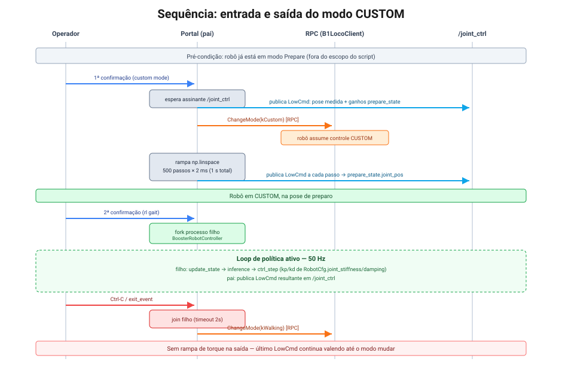

# 2. Modos do robô e ciclo de vida do deploy

> Referência: commit `0dba32b` (branch `tsinghua`).

## `RobotMode`

```cpp
// booster_robotics_sdk/include/booster/robot/common/robot_shared.hpp:7-14
enum class RobotMode {
    kUnknown = -1, ///< Modo desconhecido, usado para tratamento de erro.
    kDamping = 0,  ///< Coloca todos os motores em modo de amortecimento; o robô pode cair.
    kPrepare = 1,  ///< Mantém postura de apoio bipedal antes de andar.
    kWalking = 2,  ///< Habilita locomoção e ações de modo caminhada.
    kCustom  = 3,  ///< Habilita controle personalizado do corpo e ações.
    kSoccer  = 4,  ///< Habilita locomoção e ações de futebol; suportado em: K1 | T1.
};
```

A troca de modo é uma chamada **RPC** (não pub/sub) — ver [01](01-arquitetura-comunicacao.md):

```cpp
// booster_robotics_sdk/include/booster/robot/b1/b1_loco_client.hpp:127-131
int32_t ChangeMode(RobotMode mode) {
    ChangeModeParameter change_mode(mode);
    std::string param = change_mode.ToJson().dump();   // {"mode": <int>}
    return SendApiRequest(LocoApiId::kChangeMode, param);
}
```

Não existe um método `PrepareMode()` separado — chama-se `ChangeMode(kPrepare)`. O
`booster_deploy` **nunca usa `kPrepare` nem `kDamping` diretamente**: a "preparação" antes do
CUSTOM é inteiramente caseira, implementada com uma rampa de posições em Python (ver abaixo).

## Confirmação: o deploy roda em modo CUSTOM

Sim. É exatamente o que o `BoosterRobotPortal.start_custom_mode_conditionally()` faz. Em modo
CUSTOM, o campo `weight` do `MotorCmd` é ignorado — o controlador on-board cede toda a
autoridade sobre as juntas para o stream de `LowCmd` publicado pelo cliente.

## Sequência completa de entrada e saída



### Pré-condição

O robô deve já estar em `Prepare` (postura bipedal de apoio) antes de rodar
`scripts/deploy.py`. O README do SDK e os exemplos de baixo nível deixam isso explícito: o
robô precisa estar mantendo a postura de preparo antes de o processo cliente assumir o
controle.

### 1. Primeira confirmação do operador → entrada em CUSTOM

```python
# booster_deploy/controllers/booster_robot_controller.py:298-344
def start_custom_mode_conditionally(self):
    print(f"{self.remoteControlService.get_custom_mode_operation_hint()}")
    while not self.exit_event.is_set():
        if self.remoteControlService.start_custom_mode():
            break
        time.sleep(0.1)
    ...
    while rclpy.ok() and self.low_cmd_publisher.get_subscription_count() == 0:
        self.logger.info("Waiting for '/joint_ctrl' subscriber, retry in 0.5s")
        time.sleep(0.5)

    prepare_state = self.robot.cfg.prepare_state
    init_joint_pos = self.synced_state.read()[0]['joint_pos']
    for i in range(self.robot.num_joints):
        self.motor_cmd[i].q = init_joint_pos[i]
        self.motor_cmd[i].kp = float(prepare_state.stiffness[i])
        self.motor_cmd[i].kd = float(prepare_state.damping[i])
    self.low_cmd_publisher.publish(self.low_cmd)
    time.sleep(0.1)

    self.client.ChangeMode(RobotMode.kCustom)

    trans = np.linspace(init_joint_pos, prepare_state.joint_pos, num=500)
    start_time = self.timer.get_time()
    for i in range(500):
        for j in range(self.robot.num_joints):
            self.motor_cmd[j].q = trans[i][j]
        self.low_cmd_publisher.publish(self.low_cmd)
        while self.timer.get_time() < start_time + (i + 1) * 0.002:
            time.sleep(0.0002)
```

Passo a passo:

1. Espera o operador confirmar via joystick/teclado (`RemoteControlService`).
2. Espera existir um assinante no tópico `/joint_ctrl` (garante que o firmware do robô já
   está pronto para receber comandos).
3. **Antes de trocar de modo**, publica um `LowCmd` segurando a **pose medida** (`joint_pos`
   lido do último `/low_state`) com os ganhos de `prepare_state`. Isso evita um salto brusco
   de torque no instante da troca de modo.
4. Chama `ChangeMode(RobotMode.kCustom)` via RPC.
5. Interpola (`np.linspace`) da pose medida até `prepare_state.joint_pos` em **500 passos de
   2 ms** (1 segundo total), publicando um `LowCmd` a cada passo — uma rampa suave até a pose
   de preparo definida na configuração do robô.

Há uma verificação de modo comentada no código:

```python
# booster_deploy/controllers/booster_robot_controller.py:326-333
# for i in range(20):  # try multiple times to make sure mode is changed
#     self.client.ChangeMode(RobotMode.kCustom)
#     time.sleep(0.5)
#     if (mode:= self.client.GetStatus().current_mode) == RobotMode.kCustom:
#         break
# else:
#     self.logger.error("Failed to switch to custom mode")
#     return False
```

Isso indica que, na versão do binding Python usada quando este código foi escrito,
`GetStatus()` provavelmente não estava disponível ou não era confiável — o código atual
**assume** que `ChangeMode` teve sucesso, sem confirmar. Ver
[05 — Armadilhas conhecidas](05-armadilhas-conhecidas.md).

### 2. Segunda confirmação do operador → início da política

```python
# booster_deploy/controllers/booster_robot_controller.py:346-370
def start_rl_gait_conditionally(self):
    print(f"{self.remoteControlService.get_rl_gait_operation_hint()}")
    while not self.exit_event.is_set():
        if self.remoteControlService.start_rl_gait():
            break
        time.sleep(0.1)
    ...
    self.inference_process = mp.Process(
        target=BoosterRobotPortal.inference_process_func,
        args=(self.cfg, self),
        daemon=True,
    )
    self.inference_process.start()
```

Só depois de uma **segunda** confirmação explícita do operador é que o processo de inferência
da política é iniciado (fork separado — ver [04](04-mapa-do-framework.md)). Duas confirmações
distintas (entrar em CUSTOM vs. começar a andar) dão ao operador uma janela para abortar entre
a rampa de preparo e a política de fato assumir o controle.

### 3. Saída

```python
# booster_deploy/controllers/booster_robot_controller.py:459-461
self.logger.info("Exiting controller, switching to walking mode...")
self.client.ChangeMode(RobotMode.kWalking)
```

Ao sair (fim natural do loop, `Ctrl-C`, ou morte do processo de inferência), o modo volta para
`kWalking` — não `kDamping` nem `kPrepare`. **Não há rampa de torque na saída**: o último
`LowCmd` publicado continua valendo até a troca de modo ser processada. Ver o runbook
([06](06-runbook-deploy-real.md)) para o procedimento de abort seguro.

## `weight` e controle parcial do corpo

O campo `weight` do `MotorCmd` é o fator de mistura usado em modos que **não** são CUSTOM
(por exemplo, um overlay de braço rodando por cima do modo `kWalking`). Em modo CUSTOM ele é
ignorado — o `booster_deploy` sempre o define como `0.0` (`booster_robot_controller.py:292`),
o que é coerente com o fato de nunca operar fora de CUSTOM.

Para controle parcial do corpo sem entrar totalmente em CUSTOM, o SDK expõe
`UpperBodyCustomControl(bool)` (RPC, `LocoApiId::kUpperBodyCustomControl = 2030`) — usado por
outros componentes do SDK (ex. `ArmController`) para tomar controle só da parte superior do
corpo enquanto as pernas continuam sob o controlador de marcha nativo. O `booster_deploy` não
usa esse caminho — ele sempre assume controle total do corpo via CUSTOM.

## Ver também

- [01 — Arquitetura de comunicação](01-arquitetura-comunicacao.md): por que `ChangeMode` é uma
  chamada RPC e não uma mensagem pub/sub.
- [06 — Runbook de deploy](06-runbook-deploy-real.md): checklist operacional em torno desta
  sequência.
