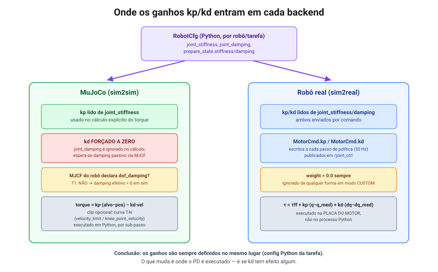

# 3. Ganhos do controlador PD: simulação (MuJoCo) vs. robô real

> Referência: commit `0dba32b` (branch `tsinghua`).

## Resposta direta

**Os ganhos são parametrizáveis no config Python da tarefa de deploy — não há nada para
alterar diretamente na plataforma do robô.** Não existe nenhum arquivo YAML/JSON no
repositório: toda configuração é feita através de `@configclass` (dataclasses Python) em
`booster_deploy/controllers/controller_cfg.py`, `booster_deploy/robots/booster.py`, e nos
arquivos de cada tarefa em `tasks/*/`.

No robô real, os ganhos `kp`/`kd` **não ficam configurados em firmware nem em nenhuma
plataforma separada** — eles são reenviados a cada comando, dentro do próprio `MotorCmd`, e o
PD de fato roda nas placas dos motores (não no processo Python). Em MuJoCo, o PD é computado
explicitamente em Python a cada passo de física.



## Dois conjuntos de ganhos por robô

`RobotCfg` (`booster_deploy/controllers/controller_cfg.py:43-79`) define **dois** conjuntos
de ganhos, usados em momentos diferentes do ciclo de vida:

| Campo | Quando é usado |
|---|---|
| `prepare_state.stiffness` / `prepare_state.damping` | Só durante a rampa de entrada em modo CUSTOM ([02](02-modos-e-ciclo-de-vida.md)) — tipicamente ganhos altos, para segurar uma postura rígida |
| `joint_stiffness` / `joint_damping` | Regime normal, quando a política já está no controle |

Ambos vivem em `PrepareStateCfg` / `RobotCfg` (`controller_cfg.py:9-12,52-53`) e são definidos
por robô em `booster_deploy/robots/booster.py` (`K1_CFG`, `T1_23DOF_CFG`).

## Caminho no robô real

```python
# booster_deploy/controllers/booster_robot_controller.py:523-530
def ctrl_step(self, dof_targets: torch.Tensor) -> None:
    for i in range(self.robot.num_joints):
        self.portal.motor_cmd[i].q = float(dof_targets[i].item())
        kp_val = float(self.robot.joint_stiffness[i].item())
        kd_val = float(self.robot.joint_damping[i].item())
        self.portal.motor_cmd[i].kp = kp_val
        self.portal.motor_cmd[i].kd = kd_val
    self.portal.low_cmd_publisher.publish(self.portal.low_cmd)
```

A cada passo da política (50 Hz por padrão — `policy_dt = 0.02`), o controlador escreve
`q, kp, kd` diretamente no `MotorCmd` de cada junta e publica. O torque efetivo é calculado
**pela placa do motor**, não pelo processo Python:

```
τ = τ_ff + kp · (q_alvo − q_medido) + kd · (dq_alvo − dq_medido)
```

Consequência prática: um `kp`/`kd` deixados em `0.0` tornam a junta livre (sem rigidez nem
amortecimento) — é exatamente o mecanismo que outras partes do SDK usam para "soltar" juntas
que não estão sob controle ativo.

## Caminho no MuJoCo (sim2sim)

```python
# booster_deploy/controllers/mujoco_controller.py:205-251
def ctrl_step(self, dof_targets: torch.Tensor):
    ...
    dof_pos = self.mj_data.qpos.astype(np.float32)[7:]
    dof_vel = self.mj_data.qvel.astype(np.float32)[6:]
    kp = self.robot.joint_stiffness.numpy()
    # kd is applied as passive joint damping in the XML (implicit, via MuJoCo solver),
    # not as an explicit torque in the PD loop. This matches IsaacLab's ImplicitActuator
    # behaviour and avoids generating horizontal contact forces that cause sliding.
    kd = np.zeros_like(kp)
    effort_limit = self.robot.effort_limit.numpy()
    ...
    for i in range(self.decimation):
        torque = kp * (dof_targets - dof_pos) - kd * dof_vel   # kd é sempre 0 aqui
        if velocity_limit is not None:
            # curva T-N por partes (BoosterDelayedPDActuator)
            vel_abs = np.abs(dof_vel)
            tau_linear = effort_limit * (velocity_limit - vel_abs) / denom
            max_torque = np.clip(tau_linear, 0.0, effort_limit)
        else:
            max_torque = effort_limit
        self.mj_data.ctrl = np.clip(torque, -max_torque, max_torque)
        mujoco.mj_step(self.mj_model, self.mj_data)
        dof_pos = self.mj_data.qpos.astype(np.float32)[7:]
        dof_vel = self.mj_data.qvel.astype(np.float32)[6:]
```

Diferenças-chave em relação ao real:

- O PD é **explícito**, calculado em Python, a cada sub-passo de física dentro do laço de
  `decimation` (por padrão 10 sub-passos por passo de política, ver
  [04](04-mapa-do-framework.md) para a relação `physics_dt = policy_dt / decimation`).
- **`kd` é forçado a zero** — o código assume que o amortecimento passivo vem do próprio
  modelo MJCF (`mj_model.dof_damping`), replicando o comportamento do `ImplicitActuator` do
  IsaacLab. **Isso só funciona se o MJCF do robô realmente declarar damping por junta.** Para
  o T1, ele não declara — ver [05](05-armadilhas-conhecidas.md) para o impacto disso.
- Há um limite de torque opcional em forma de curva torque-velocidade (T-N), fora do que o
  robô real implementa neste nível: se `velocity_limit`/`knee_point_velocity` estiverem
  definidos em `RobotCfg`, o torque máximo decai linearmente conforme a velocidade da junta se
  aproxima do limite (`velocity_limit`), simulando a curva de um `BoosterDelayedPDActuator`.
  Quando `None`, o limite é simplesmente `effort_limit` constante.

## Onde sobrescrever os ganhos, na prática

Hierarquia de configuração (do mais genérico ao mais específico):

1. **`RobotCfg` por robô** — `booster_deploy/robots/booster.py`. Define `joint_stiffness`,
   `joint_damping`, `effort_limit` e `prepare_state` "de fábrica" para `K1_CFG` e
   `T1_23DOF_CFG`.
2. **`ControllerCfg` da tarefa** — `tasks/<nome>/<nome>.py`. Cada tarefa tipicamente
   instancia sua própria subclasse/instância de `RobotCfg` (ou reaproveita a base com campos
   sobrescritos) para ajustar ganhos ao seu caso de uso.
3. **`__init__.py` da tarefa** — algumas tarefas (ex. `k1_mj2`, `k1_fight` em
   `tasks/beyond_mimic/__init__.py`) sobrescrevem `kp`/`kd`/`effort_limit` diretamente na
   chamada de registro, sem tocar no arquivo principal da tarefa.

### Exemplos reais de ganhos diferentes por tarefa

- `T1WalkControllerCfg` (`tasks/locomotion/locomotion.py:205-262`): `kp` = 4 (cabeça) / 50
  (braços) / 200 (pernas) / 50 (tornozelos), `kd` = 1 / 1 / 5 / 2.
- `chute_t1` (`tasks/chute_t1/chute_t1.py:35-87`): ganhos **derivados analiticamente** da
  física do motor, em vez de ajustados manualmente:
  ```
  kp = armature · (2π·f_n)²         f_n = 10 Hz
  kd = 2·ζ·armature·(2π·f_n)        ζ = 2.0
  ```
  calculados por modelo de motor (`DM4310`, `E4310`, `E6408`, `E8112`, `E8116`, `E4315`),
  resultando em `kp` entre `7.11` e `268.10`, `kd` entre `0.45` e `17.07`
  (`chute_t1.py:44-72`).
- `tasks/mimickit_steering/mimickit_steering.py:70-76`: `T1_KD` é derivado de `T1_KP` por uma
  razão fixa (`kd = round(0.0637 * kp, 4)`), em vez de ser tabelado separadamente.

### `action_scale` não é um ganho de PD, mas interage com eles

Vale diferenciar: `PolicyCfg.action_scale` (quando presente, ex.
`LocomotionPolicyCfg.action_scale = 0.25`) escala a **saída da rede** antes de somá-la à pose
padrão para formar o alvo de posição (`dof_targets`) — não é o mesmo que `kp`/`kd`, mas afeta
o comportamento efetivo do PD porque muda a amplitude do erro `(alvo − medido)`. Em
`beyond_mimic.py:29-31`, esse escalonamento é inclusive **derivado dos próprios ganhos**:
`action_scale = 0.25 * effort_limit / joint_stiffness`.

## Ferramenta de comparação: os três esquemas de damping do `mimickit_steering`

A tarefa `t1_mimickit_steering` expõe deliberadamente três variantes de controlador MuJoCo
para comparar esquemas de amortecimento lado a lado (`tasks/mimickit_steering/controllers.py:141-175`):

| Controller | Comportamento de `kd` |
|---|---|
| `ExplicitPDController` | `kd` explícito em Python (como o real) |
| `ImplicitDampingController` | `kd = 0` em Python, damping via `mj_model.dof_damping` (como o `MujocoController` padrão) |
| `ZeroDampingController` | Sem damping algum, nem explícito nem passivo |

Selecionável via `--pd {explicit,implicit,none}` no teleop dessa tarefa
(`tasks/mimickit_steering/teleop.py`). Útil como referência para investigar divergências
sim2real relacionadas a amortecimento.

## Tabela-resumo

| | MuJoCo (sim2sim) | Robô real (sim2real) |
|---|---|---|
| Onde o PD roda | Processo Python (`ctrl_step`) | Placa do motor (firmware) |
| Quem envia `kp`/`kd` | N/A (calculado localmente) | Enviado a cada `MotorCmd`, a cada passo de política |
| `kd` efetivo | Sempre `0` no cálculo Python; depende do MJCF declarar damping passivo | Valor de `joint_damping` da config, aplicado pela placa |
| Limite de torque | `effort_limit`, opcionalmente com curva T-N (`velocity_limit`/`knee_point_velocity`) | Implementado em firmware, fora do escopo deste repositório |
| Onde configurar | `RobotCfg` + overrides por tarefa (Python) | Mesmo lugar — nenhuma configuração separada na plataforma do robô |

## Ver também

- [04 — Mapa do framework](04-mapa-do-framework.md): `physics_dt = policy_dt / decimation` e
  onde o `decimation` é definido.
- [05 — Armadilhas conhecidas](05-armadilhas-conhecidas.md): por que `joint_damping` não tem
  efeito nenhum na simulação MuJoCo do T1 especificamente.
