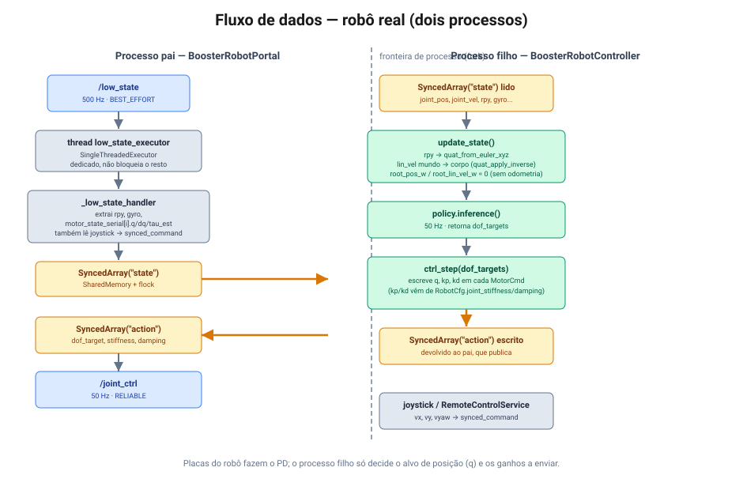
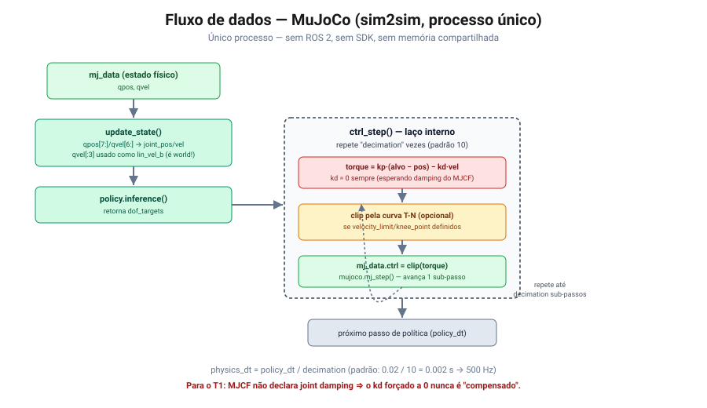
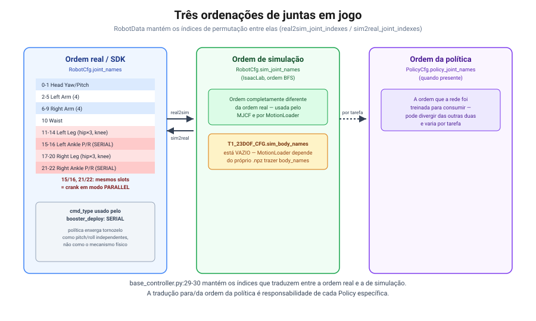

# 4. Mapa do framework `booster_deploy`

> Referência: commit `0dba32b` (branch `tsinghua`).

## Ponto de entrada único

```
booster_deploy/
├─ scripts/deploy.py          # único entry point
├─ booster_deploy/
│   ├─ controllers/
│   │   ├─ base_controller.py           # abstrações comuns
│   │   ├─ controller_cfg.py            # todos os schemas de config
│   │   ├─ mujoco_controller.py         # backend sim2sim
│   │   └─ booster_robot_controller.py  # backend sim2real (ROS 2 + SDK)
│   ├─ robots/booster.py                # K1_CFG, T1_23DOF_CFG
│   └─ utils/                           # registry, motion_loader, joystick, shared memory, métricas
└─ tasks/                     # uma pasta por tarefa registrada
```

```python
# scripts/deploy.py:29-84 (resumo)
for mod_info in pkgutil.walk_packages(tasks_pkg.__path__, prefix="tasks."):
    __import__(mod_info.name)          # importa cada tasks/* — efeito colateral: registra a task
...
if args.mujoco:
    MujocoController(task_cfg).run()
else:
    from booster_robotics_sdk_python import ChannelFactory
    ChannelFactory.Instance().Init(0, args.net)
    if args.webots:
        ankles = [-8, -7, -2, -1]
        for i in ankles: task_cfg.robot.joint_damping[i] = 0.5
    with BoosterRobotPortal(task_cfg, use_sim_time=args.webots) as portal:
        portal.run()
```

Três modos de execução, todos pelo mesmo script:

| Flag | Backend | Observação |
|---|---|---|
| `--mujoco` | `MujocoController` | único processo, sem ROS/SDK |
| (nenhuma) | `BoosterRobotPortal` | robô real — **default** |
| `--webots` | `BoosterRobotPortal` com `use_sim_time=True` | mesmo caminho de código do real, com relógio simulado e damping extra nos tornozelos |

## Abstrações comuns (`base_controller.py`)

```python
# booster_deploy/controllers/base_controller.py (resumo)
class RobotData:       # struct de estado canônico, ordenado como no robô real
    joint_pos, joint_vel, feedback_torque
    root_pos_w, root_quat_w, root_lin_vel_b, root_ang_vel_b

class BoosterRobot:     # RobotCfg convertido em tensores
    joint_stiffness, joint_damping, default_joint_pos
    effort_limit, velocity_limit, knee_point_velocity

class Policy(ABC):
    def reset(self) -> None: ...
    def inference(self) -> torch.Tensor: ...   # retorna dof_targets

class BaseController(ABC):
    # concreto:
    def start(self): ...        # reseta contadores + policy.reset()
    def policy_step(self): ...  # incrementa passo, chama policy.inference()
    def stop(self): ...
    # abstrato, um por backend:
    def ctrl_step(self, dof_targets): ...
    def update_state(self): ...
    def run(self): ...
```

`MujocoController` e `BoosterRobotController` implementam o mesmo contrato
(`BaseController`). Uma `Policy` só enxerga `controller.robot.data` e
`controller.vel_command` — não sabe (nem precisa saber) se está rodando em sim ou no robô
real. Recursos exclusivos de simulação (ghost de referência, etc.) são acessados por duck
typing (`hasattr(self.controller, "set_reference_qpos")`), não pela interface base.

## Arquitetura de dois processos no robô real

Diferente do MuJoCo (um processo só), o backend real é **dois processos**:

- **`BoosterRobotPortal`** (processo pai): dono da comunicação — DDS/ROS 2, RPC do SDK,
  leitura do joystick, transições de modo. Não roda inferência.
- **`BoosterRobotController`** (processo filho, `BaseController`): roda `update_state`,
  `policy_step`, `ctrl_step` — a inferência de fato.

A ponte entre os dois é memória compartilhada (`SyncedArray`, `SharedMemory` + `flock`),
com três buffers:

```python
# booster_deploy/controllers/booster_robot_controller.py:98-142 (resumo)
action_dtype  = [("dof_target", ...), ("stiffness", ...), ("damping", ...)]
state_dtype   = [("root_rpy_w", ...), ("root_ang_vel_b", ...), ("root_pos_w", ...),
                 ("root_lin_vel_w", ...), ("joint_pos", ...), ("joint_vel", ...),
                 ("feedback_torque", ...)]
command_dtype = [("vx", float), ("vy", float), ("vyaw", float)]
```



Fluxo, em ordem: `/low_state` (500 Hz) → thread dedicada `low_state_executor` →
`_low_state_handler` (extrai `rpy`, `gyro`, `motor_state_serial[i].q/dq/tau_est`) → escreve em
`synced_state` → [fronteira de processo] → `BoosterRobotController.update_state()` converte
`rpy` → quaternion e velocidade linear mundo → corpo → `policy.inference()` (50 Hz) →
`ctrl_step()` escreve `q, kp, kd` → publica `/joint_ctrl`.

Em paralelo, o joystick alimenta `synced_command` (`vx, vy, vyaw`), lido por
`update_vel_command()` no processo filho.



No MuJoCo, o mesmo papel é feito dentro de um único processo:
`mj_data` → `update_state()` (leitura direta de `qpos`/`qvel`) → `policy.inference()` →
`ctrl_step()` com o laço interno de `decimation` sub-passos de física.

## Taxas de controle

```python
# booster_deploy/controllers/controller_cfg.py:118-119
def __post_init__(self):
    self.mujoco.physics_dt = self.policy_dt / self.mujoco.decimation
```

| Config | Valor padrão | Significado |
|---|---|---|
| `ControllerCfg.policy_dt` | `0.02` s (50 Hz) | Taxa de inferência da política e de publicação de `LowCmd` |
| `MujocoControllerCfg.decimation` | `10` | Sub-passos de física por passo de política |
| `MujocoControllerCfg.physics_dt` | derivado: `0.02/10 = 0.002` s (500 Hz) | Passo de física do MuJoCo |
| `BoosterRobotControllerCfg.low_state_dt` | `0.002` s (500 Hz) | Cadência esperada de `/low_state` |

Ou seja: **estado a 500 Hz, política/comando a 50 Hz**, tanto em sim quanto no real — a
diferença é só como cada backend preenche esse contrato.

## Três ordenações de juntas

Existem até três convenções de ordenação de juntas em jogo simultaneamente:

1. **Ordem do robô real / SDK** (`RobotCfg.joint_names`) — a ordem que o `MotorCmd`/`LowState`
   usam.
2. **Ordem de simulação** (`RobotCfg.sim_joint_names`) — ordem BFS do IsaacLab, usada pelo
   MJCF e pelos observadores/carregadores de movimento.
3. **Ordem da própria política** (`PolicyCfg.policy_joint_names`, quando presente) — a ordem
   que a rede foi treinada para consumir.

```python
# booster_deploy/controllers/base_controller.py:29-30
self.real2sim_joint_indexes = [cfg.joint_names.index(n) for n in cfg.sim_joint_names]
self.sim2real_joint_indexes = [cfg.sim_joint_names.index(n) for n in cfg.joint_names]
```



### Tornozelo: `SERIAL` vs `PARALLEL`

O T1 tem um mecanismo de tornozelo paralelo. `LowCmd.cmd_type` seleciona o espaço de
coordenadas:

- `PARALLEL`: comanda os motores físicos do "crank" diretamente (índices `kCrankUpLeft` /
  `kCrankDownLeft` / equivalentes à direita).
- `SERIAL`: comanda pitch/roll equivalentes do tornozelo; o firmware resolve a cinemática do
  mecanismo internamente.

O `booster_deploy` usa **`SERIAL`** (`booster_robot_controller.py:282`) e lê de volta
`motor_state_serial` (`:237`) — ou seja, do ponto de vista da política, o tornozelo se
comporta como uma junta serial comum (pitch/roll independentes), não como o mecanismo
paralelo físico.

## Tarefas registradas

| Nome (`--task`) | Robô | Pasta | Observações |
|---|---|---|---|
| `t1_walk` | T1 | `tasks/locomotion/` | Marcha básica |
| `k1_mj2` | K1 | `tasks/beyond_mimic/` | Rastreamento de movimento de referência |
| `k1_fight` | K1 | `tasks/beyond_mimic/` | Variante de `beyond_mimic` com ganhos próprios |
| `chute_t1` | T1 | `tasks/chute_t1/` | **Atualmente não inicia** — checkpoint/motion em `models/paper/` e `motions/paper/`, ambos ausentes (gitignorados) |
| `t1_mimickit_steering` | T1 | `tasks/mimickit_steering/` | Sim-only (sem odometria no real — ver [05](05-armadilhas-conhecidas.md)); tem README próprio e teleop dedicado |

Registro via `utils/registry.py` (`register_task`/`get_task`/`list_tasks`); listar com
`python3 scripts/deploy.py --list`.

## Ver também

- [01 — Arquitetura de comunicação](01-arquitetura-comunicacao.md)
- [03 — Ganhos PD](03-ganhos-pd-sim-vs-real.md)
- [05 — Armadilhas conhecidas](05-armadilhas-conhecidas.md)
