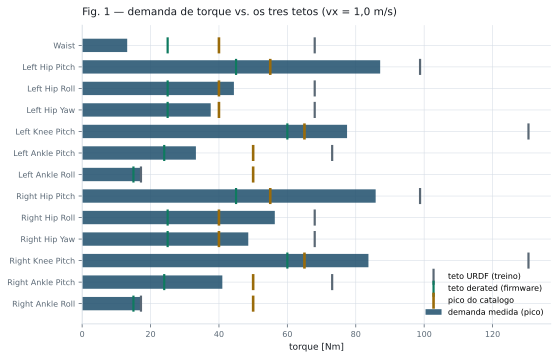
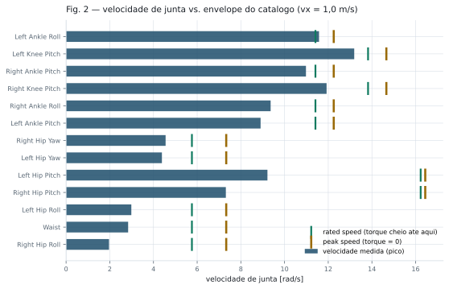
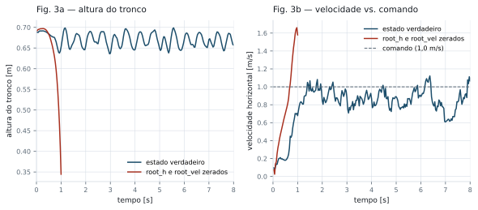
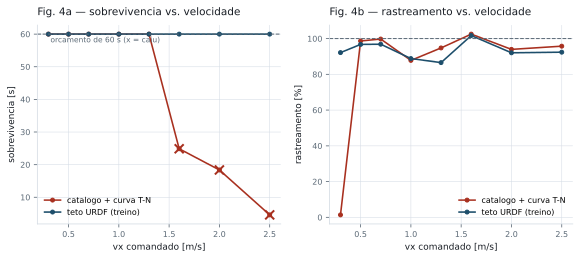
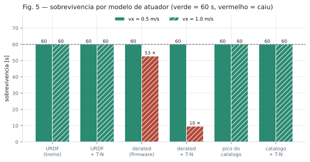

# 9. Análise gráfica dos experimentos de viabilidade

> Figuras geradas por `scripts/plot_viability.py` a partir das saídas de
> `scripts/sim_viability.py`. Reprodução: runlist R15–R16 em
> [08 — Caminho para hardware](08-caminho-para-hardware-mimickit.md#9-runlist-de-validação).
>
> Checkpoint: `models/t1_wrturn_s1/policy.pt`. Esquema de PD: `explicit` (o análogo do
> hardware, onde a placa do motor calcula `kp(q*−q) + kd(0−dq)`).
>
> **Revalidado contra o release `7bb1462e`** (branch `tsinghua-v2`): a runlist foi re-executada
> inteira e **os números reproduzem exatamente** — ver
> [11 §3b](11-reavaliacao-release-2026-09.md#3b-a-runlist-reproduzida). As figuras da versão nova
> estão em [`diagramas/v2/`](diagramas/v2/); as desta página são as do baseline, reproduzíveis na
> tag `baseline-docs-09`.

```sh
bash scripts/sweep_viability.sh                                   # ~20 min, 32 rodadas
.venv/bin/python scripts/plot_viability.py --in /tmp/viab --out docs/diagramas
```

## Fig. 1 — Demanda de torque contra os três tetos



Pico de `|qfrc_actuator|` por junta de perna em 60 s a 1,0 m/s, com as três referências
sobrepostas como marcadores.

O que a figura mostra e as tabelas escondiam: **a barra cruza o marcador laranja em quase todo
o quadril.** O laranja é o pico físico do catálogo do fabricante, não um limite de política —
o atuador não passa dali por construção. O marcador cinza (URDF, contra o qual a política
treinou) está bem à direita do laranja nas juntas de perna, que é o problema de fundo: o treino
autorizou torque que o hardware não tem.

O braço é o único grupo onde URDF e catálogo praticamente coincidem (38,3 contra 36 Nm), e é
também onde a demanda fica folgada. O descasamento é um fenômeno de perna.

### Os três tetos, em números

Por grupo de atuador — esquerda e direita são idênticas, então 23 juntas colapsam em 8 linhas
sem perda. `firmware` é `T1_EFFORT_FIRMWARE`, `URDF` é `T1_EFFORT_URDF` (o teto contra o
qual a política treinou), `pico` e `nominal` vêm de
[`boosteractuatordata.pdf`](info_sources/boosteractuatordata.pdf) via
`t1_actuators.T1_ACTUATOR_CATALOG`.

> **Nota de versão.** A coluna `firmware` era lida de `T1_23DOF_CFG.effort_limit`. O release
> `7bb1462e` repontou essa constante para os valores do **URDF**, o que tornaria as colunas
> `firmware` e `URDF` idênticas — e a Fig. 5 uma comparação de um modelo contra ele mesmo, sem
> erro visível. Os três tetos passaram a ser constantes fixas em
> `booster_deploy/robots/t1_actuators.py`, com asserção que falha se `firmware` e `URDF`
> coincidirem. Ver [11 §2a](11-reavaliacao-release-2026-09.md#2a-effort_limit-trocou-de-significado--o-risco-mais-grave).

| Grupo (nº juntas) | firmware | URDF | nominal | **pico** | URDF/pico | firmware/pico |
|---|---:|---:|---:|---:|---:|---:|
| Neck (2) | 7,0 | 7,0 | 3,0 | **7,0** | 1,00× | 1,00× |
| Arm (8) | 18,0 | 38,3 | 10,0 | **36,0** | 1,06× | 0,50× |
| Waist (1) | 25,0 | 68,0 | 12,0 | **40,0** | **1,70×** | 0,62× |
| Hip-Pitch (2) | 45,0 | 98,8 | 20,0 | **55,0** | **1,80×** | 0,82× |
| Hip-Roll / Hip-Yaw (4) | 25,0 | 68,0 | 12,0 | **40,0** | **1,70×** | 0,62× |
| Knee (2) | 60,0 | 130,5 | 25,0 | **65,0** | **2,01×** | 0,92× |
| Ankle-Pitch (2) | 24,0 | 73,1 | 15,0 | **50,0** | **1,46×** | 0,48× |
| Ankle-Roll (2) | 15,0 | 17,2 | 15,0 | **50,0** | 0,34× | 0,30× |

Todos os valores em N·m. "nominal" é o *rated torque* do catálogo — o regime contínuo; "pico"
é o *peak torque*, o máximo instantâneo.

Três leituras:

- **O URDF excede o pico físico em todo o membro inferior**, até **2,01×** no joelho. Não é um
  teto generoso: é um teto que o atuador não alcança em nenhuma condição. Só Neck e Arm estão
  dentro (1,00× e 1,06×).
- **O firmware fica abaixo do pico em todas as juntas** (0,30× a 1,00×), o que é coerente com
  um limite de operação. Se ele já embute a queda com velocidade é a questão Q1 de
  [10 — Pontos de discussão](10-discussao-proximos-passos.md).
- **Ankle-Roll é a exceção que confirma o mecanismo.** URDF 17,2 contra pico de motor de 50 —
  o tornozelo do T1 é paralelo/diferencial, então o limite *na junta* não é o limite *no motor*.
  A mesma razão explica os dois valores de `armature` do MJCF que não fecharam em
  `inércia × gear²` (§4d de [08](08-caminho-para-hardware-mimickit.md)).

Contra a demanda medida a 1,0 m/s (`m_urdf_vx1.0.npz`, teto URDF, estado verdadeiro):

| Grupo | pico exigido | pico do catálogo | razão |
|---|---:|---:|---:|
| Hip-Pitch | 87,14 | 55,0 | **1,58×** |
| Hip-Roll / Hip-Yaw | 56,33 | 40,0 | **1,41×** |
| Knee | 83,71 | 65,0 | **1,29×** |
| Ankle-Pitch | 40,99 | 50,0 | 0,82× |
| Ankle-Roll | 17,20 | 50,0 | 0,34× (satura no limite da junta) |
| Waist | 13,17 | 40,0 | 0,33× |
| Arm | 5,30 | 36,0 | 0,15× |
| Neck | 1,72 | 7,0 | 0,25× |

Quadril e joelho pedem acima do fisicamente possível; tornozelo, cintura, braço e pescoço
operam com folga. É o quadril que define o problema.

> `qfrc_actuator` é amostrado a 30 Hz e não nos 120 Hz dos substeps, então **todos os picos
> desta figura são limites inferiores**.

## Fig. 2 — Velocidade de junta contra o envelope do catálogo



O eixo que nenhum experimento havia tocado, porque `velocity_limit` e `knee_point_velocity` são
`None` no `T1_23DOF_CFG` e a curva T-N do `ctrl_step` nunca tinha rodado.

Barras vermelhas são juntas que passam do **peak speed** — a velocidade em que o torque
disponível chega a zero. A 1,0 m/s são **7 de 23**, com o joelho a 1,35×. O verde marca o
**rated speed**, abaixo do qual há torque cheio; entre verde e laranja o torque decai
linearmente.

O duty é curto (<1% do tempo), mas cai exatamente nos instantes de maior dinâmica — que são os
instantes em que a marcha precisa do torque.

## Fig. 3 — A comparação de variável única

> **Reenquadrada por [12](12-politica-vendor-t1-walk.md).** A política que a própria Booster
> embarca (`t1_walk`) é **imune** a esta degradação — `zero_root` é um no-op exato nela, porque sua
> observação de 720 dims não contém estado de raiz. Mesma física, mesmo robô, 60 s. Logo esta
> figura não mostra que a nossa política é frágil: mostra que **esta classe de observação** é
> inviável no T1. O colapso em ~1 s também independe da taxa (1,02 s a 50 Hz).



As duas rodadas diferem em **quatro números**: `root_pos_w` e `root_lin_vel_b` zerados, como
`booster_robot_controller.py:244-249` entrega no robô. Mesmo checkpoint, mesma física, mesmo
comando.

**3a** mostra a altura do tronco despencando de 0,69 m para ~0,35 m em um segundo. **3b** é o
diagnóstico: antes de cair, a curva vermelha **ultrapassa a linha de comando** e continua
subindo. Não é "pisou um pouco errado" — é um laço de realimentação em fuga. `root_vel` de
avanço tem média de treino 0,96 m/s; entregar zero lê como "estou mais lento que o normal",
então a política empurra mais, o erro nunca fecha, e o esforço cresce até tombar.

Isso importa para a engenharia: um laço quebrado não se conserta com um estimador "bom na
maioria dos casos". Degradação graciosa toleraria erro ocasional; fuga não.

## Fig. 4 — Varredura de velocidade: onde está a fronteira



Duas séries: o modelo de atuador do **treino** (teto URDF, sem T-N) e o modelo **físico**
(pico do catálogo + curva T-N). `✕` marca queda.

**4a é o resultado mais acionável do conjunto.** A série azul é plana em 60 s até 2,5 m/s — o
topo da faixa de comando. **Sob o modelo contra o qual toda validação anterior rodou, não existe
fronteira de envelope.** A série vermelha cai de um penhasco entre **1,3 e 1,6 m/s** e degrada
progressivamente: 24,9 s a 1,6, depois 18,4 s a 2,0, depois 4,6 s a 2,5.

**4b mostra por que o rastreamento não serve de alarme.** As duas séries ficam em 86–103% em
toda a faixa, incluindo nos pontos onde a vermelha está caindo aos 4,6 s. A política rastreia
bem a velocidade *enquanto está de pé*; a métrica de tracking não antecipa a queda.

O ponto de 0,3 m/s (vermelho, 1,4%) está **abaixo do mínimo de treino** de 0,5 m/s — é
extrapolação de comando, não dado de envelope.

Limite operacional defensável para uma primeira tentativa em hardware: **0,5–1,0 m/s**, onde
todos os modelos concordam.

## Fig. 5 — Sobrevivência por modelo de atuador

> **Enfraquecida por [12](12-politica-vendor-t1-walk.md) — ler antes de usar os números.** Duas
> descobertas: (a) o `t1_walk` da Booster sobrevive 60 s nos **seis** modelos, inclusive
> `derated --tn`, logo esse envelope não é uma parede de hardware; e (b) os tempos absolutos são em
> boa parte artefato da física a 120 Hz — com controle fixo a 30 Hz e física a 300 Hz, os 9,6 s
> viram 25,1 s. A **ordenação** dos modelos se mantém; a faixa "9,6 · 52,8 · 60 s", não.



Seis modelos, dois eixos ortogonais: o teto de torque (`urdf` / `derated` / `catalog`) e a
curva T-N ligada ou não.

**A 0,5 m/s nenhum modelo derruba** — seis barras cheias. O regime suave está dentro do envelope
físico em qualquer leitura, o que é uma conclusão robusta justamente por não depender de qual
modelo está certo.

**A 1,0 m/s o efeito é de interação.** T-N com teto do URDF: 60 s. Teto derated sem T-N: 53 s.
Os dois juntos: **10 s**. A curva só morde quando o teto já está apertado — ela reduz o torque
disponível a partir do rated speed, e se a base já é 45 Nm em vez de 55, a margem acaba.

Note também que `catalog` e `catalog --tn` sobrevivem 60 s nas duas velocidades: o pico físico
(55 Nm no hip pitch) é suficiente mesmo com a queda, enquanto o derated (45 Nm) não é.

### Qual barra é o robô?

A figura não responde, e vale explicitar em vez de escolher:

- O firmware clipa nos derated → `derated`.
- O atuador não passa do pico do catálogo e perde torque com velocidade → `catalog --tn`.
- Se os valores derated **já forem** uma aproximação plana conservadora do envelope — prática
  comum, um limite de operação contínua que já embute derating térmico e de velocidade — então
  aplicar os dois é **contagem dupla**.

As três leituras formam um intervalo a 1,0 m/s: **9,6 s · 52,8 s · 60 s**. Qual ponta vale é
pergunta para a Booster, e é barata de fazer.

## O que as cinco figuras dizem juntas

1. **A observabilidade domina.** Fig. 3 é ~1 s contra 60 s mudando quatro números; Fig. 5 é
   dezenas de segundos de diferença entre modelos de atuador. Uma ordem de grandeza separa as
   duas causas.
2. **O envelope de atuador não impede, delimita.** Nenhum modelo derruba a 0,5 m/s; a fronteira
   física aparece entre 1,3 e 1,6 m/s (Fig. 4a).
3. **A validação anterior era estruturalmente cega às duas coisas.** O MuJoCo fornecia de graça
   o estado verdadeiro (Fig. 3) e um teto de torque não-físico sem queda com velocidade
   (Figs. 1, 2, 4a). Não estava quebrada — estava medindo a política contra as premissas do
   próprio treino.
4. **Rastreamento não é indicador de segurança** (Fig. 4b). 86–103% em toda a faixa, inclusive
   onde o robô cai em 4,6 s.

## Ver também

- [08 — Caminho para hardware](08-caminho-para-hardware-mimickit.md): o plano, os números e a
  runlist que reproduz cada figura.
- [07 — Método comparado: htwk-gym](07-htwk-gym-metodo-comparado.md): como evitar a lacuna de
  observabilidade por construção, se houver retreino.
