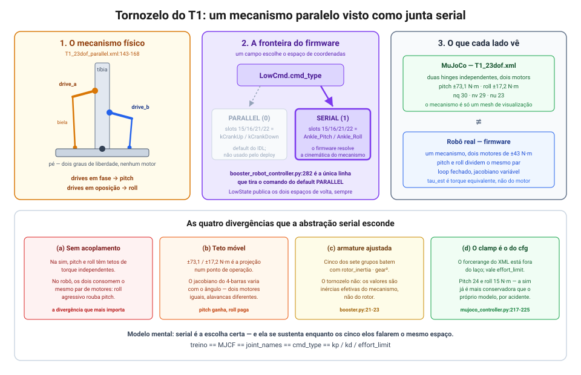

# 13. Juntas seriais e paralelas: o tornozelo do T1 entre simulação e hardware

> Referência: commit `3c7e426` (branch `tsinghua-r`).
>
> Este documento cita três repositórios **irmãos, fora do `booster_deploy`**, com caminhos
> relativos à raiz deste repo:
> `../dev_tsinghua/booster_assets` (os MJCF, instalado como editável e resolvido por
> `BOOSTER_ASSETS_DIR`), `../booster_robotics_sdk` (headers C++ e exemplos do SDK) e
> `../robocup_t1/src/booster_ros2_interface` (as mensagens ROS 2 que o deploy realmente usa).
> Citações sem prefixo são deste repositório.
>
> Expande a seção `Tornozelo: SERIAL vs PARALLEL` de
> [04](04-mapa-do-framework.md#tornozelo-serial-vs-parallel), que responde só "o que o campo
> seleciona".

## Resposta direta

O tornozelo do T1 é uma **junta paralela**: dois motores montados na tíbia empurram o pé por
duas bielas, e nenhum dos dois corresponde sozinho a pitch ou a roll — os dois agem juntos
sobre os dois graus de liberdade. O campo `LowCmd.cmd_type` escolhe em qual **espaço de
coordenadas** você fala com o firmware: `PARALLEL` comanda os motores físicos (os "cranks"),
`SERIAL` comanda pitch/roll equivalentes e deixa o firmware resolver a cinemática do mecanismo.

O `booster_deploy` fala **serial nos dois sentidos** — comanda em serial
(`booster_deploy/controllers/booster_robot_controller.py:282`) e lê o estado em serial
(`:237`). Do ponto de vista da política, o tornozelo é um par de hinges independentes, e o
mecanismo nunca aparece. **Esse é o modelo mental certo, e ele funciona — desde que os cinco
elos da cadeia da §5 estejam todos no mesmo espaço.** O que este documento faz é mostrar onde
essa abstração é fiel, onde ela mente, e como verificar cada coisa.



## 1. O que é uma junta paralela, e por que o T1 tem uma

Numa **cadeia serial**, cada grau de liberdade tem o seu motor, montado no próprio eixo: o
motor de pitch gira o eixo de pitch, o de roll gira o de roll. É o que praticamente todo o
resto do T1 faz — quadril, joelho, ombro.

Num **mecanismo paralelo**, vários atuadores agem em conjunto sobre o mesmo corpo final,
formando um **loop cinemático fechado**. No tornozelo do T1, dois motores ficam na tíbia e
acionam o pé por bielas. A motivação é direta: tirar os motores do pé reduz a inércia distal
da perna, o que importa muito numa junta que precisa reverter de direção a cada passo. O preço
é que o mapa entre ângulos de motor e ângulos de tornozelo deixa de ser identidade e vira uma
função **não-linear e acoplada**.

A geometria está no MJCF paralelo do `booster_assets`:

```xml
<!-- ../dev_tsinghua/booster_assets/robots/T1/T1_23dof_parallel.xml:143-168 (resumo, perna esquerda) -->
<site name="left_ankle_a_anchor" pos="-0.0415  0.0275 0.0327"/>   <!-- no pé, lado +y -->
<site name="left_ankle_b_anchor" pos="-0.0415 -0.0275 0.0327"/>   <!-- no pé, lado -y -->

<body name="left_ankle_drive_a_body" pos="-0.014  0.02775 -0.096">
  <joint name="left_ankle_drive_a_joint" type="hinge" axis="0 1 0" armature="0.0339552"/>
  <body name="left_ankle_rod_a">
    <joint name="left_ankle_rod_a_ball" type="ball"/>             <!-- biela -->
  </body>
</body>
<body name="left_ankle_drive_b_body" pos="-0.014 -0.02775 -0.156">
  <joint name="left_ankle_drive_b_joint" type="hinge" axis="0 1 0" armature="0.0339552"/>
  ...
</body>
```

Os dois motores giram em torno do **mesmo eixo** (`axis="0 1 0"`, o eixo de pitch da tíbia),
mas as suas bielas se fixam em pontos do pé **separados em y** (`±0.0275` m). Daí sai a
intuição de sinal:

- **Os dois drives em fase** (mesmo sentido): as duas âncoras sobem ou descem juntas → o pé faz
  **pitch**.
- **Em oposição** (sentidos contrários): uma âncora sobe, a outra desce → o pé faz **roll**.

O loop é fechado por restrições de posição, não por juntas:

```xml
<!-- ../dev_tsinghua/booster_assets/robots/T1/T1_23dof_parallel.xml:240-243 -->
<equality>
  <connect name="left_ankle_a_loop" site1="left_ankle_rod_a_end" site2="left_ankle_a_anchor" .../>
  <connect name="left_ankle_b_loop" site1="left_ankle_rod_b_end" site2="left_ankle_b_anchor" .../>
  ... (espelhado à direita)
</equality>
```

**A decomposição fase/oposição é aproximada, não exata.** Os dois drives estão em alturas
diferentes na tíbia (`z = -0.096` contra `-0.156`) e as bielas têm comprimentos diferentes
(~0,18 m contra ~0,12 m). Ou seja, o mecanismo não é simétrico: a mistura exata entre pitch e
roll depende da configuração. Isso não é detalhe estético — é a raiz de tudo que vem na §4.
Evidência independente no próprio exemplo do fabricante: a pose "neutra" dos dois cranks é
`0.2, 0.14` — assimétrica, o que não faria sentido para um par pitch/roll em repouso
(`../booster_robotics_sdk/example/low_level/b1_low_sdk_example.cpp:72-77`).

## 2. Os dois espaços de coordenadas do firmware

O contrato está na mensagem ROS 2 que o deploy usa:

```
# ../robocup_t1/src/booster_ros2_interface/msg/LowCmd.msg:1-8
# constants
int8 CMD_TYPE_PARALLEL=0
int8 CMD_TYPE_SERIAL=1

# fields
# use CMD_TYPE_PARALLEL or CMD_TYPE_SERIAL
int8 cmd_type
MotorCmd[] motor_cmd
```

E no IDL do SDK C++, com os mesmos valores:

```cpp
// ../booster_robotics_sdk/include/booster/idl/b1/LowCmd.h:94
enum CmdType : uint32_t { PARALLEL, SERIAL };
```

| | `PARALLEL` (0) | `SERIAL` (1) |
|---|---|---|
| O que os slots 15/16 e 21/22 significam | ângulos dos dois motores de crank | pitch e roll equivalentes do tornozelo |
| Quem resolve a cinemática do 4-barras | ninguém — você já está no espaço do motor | o firmware, a cada ciclo |
| Onde `kp`/`kd` do `MotorCmd` agem | no erro de ângulo **de motor** | no erro de ângulo **de tornozelo** |
| `tau_est` de volta | torque do atuador | torque **equivalente** de junta, reportado |
| Demais 19 juntas (T1) | idênticas | idênticas |

A distinção só toca os quatro slots de tornozelo. Para tudo abaixo do índice 15, os dois
espaços são o mesmo vetor.

**O enum de juntas do SDK só conhece o layout paralelo.** Não existe `kLeftAnklePitch` em
lugar nenhum do SDK:

```cpp
// ../booster_robotics_sdk/include/booster/robot/b1/b1_api_const.hpp:120-144 (trecho)
enum class JointIndex {
    ...
    kLeftKneePitch = 14,     ///< Left knee pitch joint.
    kCrankUpLeft = 15,       ///< Left upper crank joint.
    kCrankDownLeft = 16,     ///< Left lower crank joint.
    kRightHipPitch = 17,
    ...
    kCrankUpRight = 21,      ///< Right upper crank joint.
    kCrankDownRight = 22,    ///< Right lower crank joint.
};
```

Os mesmos índices 15/16/21/22 mudam de significado conforme `cmd_type`, e **o SDK não documenta
isso nem oferece um enum alternativo**. Qual crank corresponde a `drive_a` e qual a `drive_b`
também não está declarado — é inferência.

Já o estado vem nos **dois espaços simultaneamente**, no mesmo `LowState`:

```cpp
// ../booster_robotics_sdk/include/booster/idl/b1/LowState.h:229-231
booster_interface::msg::ImuState m_imu_state;
std::vector<booster_interface::msg::MotorState> m_motor_state_parallel;
std::vector<booster_interface::msg::MotorState> m_motor_state_serial;
```

Isso é importante para a §6: o robô já entrega os dois lados do mapa, de graça, a 500 Hz.

**Não existe conversão serial↔paralelo exposta.** Nenhum helper, nenhuma constante geométrica
do 4-barras, em nenhum dos dois SDKs. A conversão vive inteiramente dentro do firmware,
selecionada por `cmd_type`. Duas consequências práticas: não dá para validar offline se um
alvo pitch/roll viola o limite de algum motor ou passa perto de uma singularidade; e os ganhos
não são transferíveis entre os espaços (§5).

## 3. O que o `booster_deploy` escolhe

Serial nos dois sentidos, em duas linhas:

```python
# booster_deploy/controllers/booster_robot_controller.py:282 (comando)
self.low_cmd.cmd_type = LowCmd.CMD_TYPE_SERIAL   # type: ignore

# booster_deploy/controllers/booster_robot_controller.py:237-240 (estado)
for i, motor in enumerate(low_state_msg.motor_state_serial):
    dof_pos[i] = motor.q
    dof_vel[i] = motor.dq
    fb_torque[i] = motor.tau_est
```

E a config batiza os slots de crank com os nomes seriais, coerentemente:

```python
# booster_deploy/robots/booster.py:241-248
"Left_Ankle_Pitch", "Left_Ankle_Roll",   # slots 15, 16 — kCrankUpLeft / kCrankDownLeft
...
"Right_Ankle_Pitch", "Right_Ankle_Roll", # slots 21, 22 — kCrankUpRight / kCrankDownRight
```

Três consequências:

1. **A política vive inteiramente em espaço serial.** Ela nunca observa nem comanda um crank.
   Treino, MJCF, observação e ação falam pitch/roll.
2. **`tau_est` serial não é leitura de atuador.** É o torque *equivalente* de junta que o
   firmware reporta depois de projetar os dois motores. Onde o
   [08 §4](08-caminho-para-hardware-mimickit.md) compara demanda de torque com o catálogo do
   fabricante, os quatro valores de tornozelo são os únicos que passam por essa projeção.
3. **O default do IDL é `PARALLEL`**, não serial:

   ```cpp
   // ../booster_robotics_sdk/include/booster/idl/b1/LowCmd.h:191
   booster_interface::msg::CmdType m_cmd_type{booster_interface::msg::PARALLEL};
   ```

   E todos os exemplos do SDK usam `PARALLEL`, com `SERIAL` comentado uma linha acima
   (`../booster_robotics_sdk/example/low_level/b1_low_sdk_example.cpp:67-68`). A única coisa
   que separa "o robô anda" de "os tornozelos interpretam os alvos em coordenada errada" é a
   linha `:282` — e **não há verificação nenhuma em runtime** de que `cmd_type` bate com a
   semântica assumida em `joint_names`. O handler também itera `motor_state_serial` sem checar
   o comprimento, então um layout de outro modelo (K1=22, T2=29) passaria silenciosamente ou
   estouraria o buffer.

## 4. O que a simulação modela — e o que ela não modela

Este é o achado central. O `booster_assets` tem **dois MJCF por robô**, e o deploy usa só um
deles:

```python
# booster_deploy/robots/booster.py:340
mjcf_path="{BOOSTER_ASSETS_DIR}/robots/T1/T1_23dof.xml",
```

| | `T1_23dof.xml` (**usado**) | `T1_23dof_parallel.xml` (não usado) |
|---|---|---|
| Tornozelo | 2 hinges seriais atuadas (`:136`, `:140`) | as mesmas 2 hinges, **passivas**: `armature="0" damping="0.2"` (`:136`, `:140`) |
| Atuação | 2 motors: pitch `±73,1`, roll `±17,2` N·m (`:203-204`) | 2 drives `±43` N·m cada (`:261-262`) |
| Bielas | — | 2 corpos com junta `ball` por perna (`:152-156`, `:164-168`) |
| Loop fechado | — | 4× `<equality><connect>` (`:240-243`) |
| `nq` / `nv` / `nu` | 30 / 29 / 23 | 50 / 45 / 23 |

(`nq`/`nv`/`nu` conferidos carregando os dois modelos no MuJoCo.)

No modelo que o deploy usa, o corpo `Ankle_Cross` existe **apenas como mesh de visualização**
(`contype="0" conaffinity="0" density="0"`, `T1_23dof.xml:137`) — o mecanismo foi desenhado,
não simulado. Quatro divergências saem disso, e vale saber o sinal esperado de cada uma:

**(a) Não há acoplamento pitch↔roll.** Na sim, os dois eixos são independentes e cada um tem o
seu próprio teto de torque. No robô, os dois dividem o mesmo par de motores: um roll agressivo
consome autoridade que faltaria ao pitch no mesmo instante. Uma política que aprendeu a usar os
dois simultaneamente no limite vai encontrar menos autoridade do que espera.

**(b) O teto de torque serial é constante na sim, dependente da configuração no robô.** Os
`±73,1` e `±17,2` N·m do XML são a projeção do par de motores num ponto de operação; o
jacobiano do 4-barras varia com o ângulo. Note a assimetria: 73,1 em pitch contra 17,2 em roll
sai de dois motores **iguais** de `±43` N·m (`T1_23dof_parallel.xml:261-262`), o que é
exatamente o que uma alavanca assimétrica produz — pitch ganha vantagem mecânica, roll paga.

**(c) A `armature` do tornozelo é o único par que não fecha com o catálogo.** O próprio código
já registra isso:

```python
# booster_deploy/robots/booster.py:21-23
# Knee 196.3e-6*18**2 = 0.0636012. The two remaining values are ankle, whose
# parallel mechanism splits one motor pair across pitch and roll.
```

Ou seja, `0.0679104` (pitch) e `0.02037312` (roll) são inércias *efetivas* ajustadas, não
`rotor_inertia * gear²` como nos outros cinco grupos.

**(d) O clamp que vale na sim não é o do XML.** `ctrl_step` usa o `effort_limit` do cfg, e a
leitura de `actuator_forcerange`/`actuator_ctrlrange` do modelo está comentada:

```python
# booster_deploy/controllers/mujoco_controller.py:217-225 (resumo)
# ctrl_limit = [ np.minimum(self.mj_model.actuator_forcerange[:, 0], ...) ]
effort_limit = self.robot.effort_limit.numpy()
```

```python
# booster_deploy/robots/booster.py:301-307
effort_limit=[..., 45, 25, 25, 60, 24, 15,   # ankle pitch 24, ankle roll 15
                   45, 25, 25, 60, 24, 15,]
```

Então a simulação já é **três vezes mais conservadora** que o XML em pitch (24 contra 73,1) e
um pouco em roll (15 contra 17,2) — por acidente de configuração, não por desenho. Isso é
tranquilizador quanto a (b), mas não resolve (a): conservador nos dois eixos separadamente
ainda não é o mesmo que um orçamento compartilhado.

**Por que não basta apontar o `mjcf_path` para o modelo paralelo.** `nq` e `nv` mudam (30/29 →
50/45), e o controlador assume free joint na raiz seguido de exatamente `len(joint_names)`
juntas:

```python
# booster_deploy/controllers/mujoco_controller.py:145-147
dof_pos = self.mj_data.qpos.astype(np.float32)[7:]
dof_vel = self.mj_data.qvel.astype(np.float32)[6:]
```

Com o MJCF paralelo, `qpos[7:]` teria 43 elementos (incluindo quatérnios das juntas `ball`) em
vez de 23. `ctrl_step` também escreve `self.mj_data.ctrl` inteiro
(`mujoco_controller.py:248`), e os atuadores ali são os quatro drives, não pitch/roll. Usar o
modelo paralelo é um projeto — mapear alvo serial → drive, converter estado de volta — que
só faz sentido depois de ter o mapa da §6.

## 5. Modelo mental: o contrato de espaço de ação

A abstração que sustenta tudo é uma **cadeia de igualdades que precisa valer ponta a ponta**:

```
espaço em que a política foi treinada
  == espaço do MJCF/IsaacLab do treino
  == espaço que o cfg nomeia em joint_names
  == espaço selecionado por cmd_type
  == espaço em que kp / kd / effort_limit foram escolhidos
```

**A regra é: escolha serial e mantenha serial nos cinco elos.** O mecanismo paralelo vira
detalhe de firmware — invisível e irrelevante — *desde que ninguém no caminho troque de
espaço*. Todo o resto deste documento é a lista de lugares onde alguém poderia trocar sem
avisar.

Checklist, um item por elo:

| Elo | Como verificar |
|---|---|
| 1. Treino | O ambiente de treino usou `T1_23dof.xml` (serial), não o `_parallel`? Os nomes `*_Ankle_Pitch`/`*_Ankle_Roll` aparecem no `policy_joint_names`? |
| 2. MJCF do deploy | `booster.py:340` aponta para `T1_23dof.xml` — sim, hoje |
| 3. `joint_names` | `booster.py:241-248` nomeia os slots 15/16/21/22 como pitch/roll — coerente com serial |
| 4. `cmd_type` | `booster_robot_controller.py:282` seta `CMD_TYPE_SERIAL` explicitamente. **Este é o elo frágil**: o default do IDL é `PARALLEL` |
| 5. Ganhos | `joint_stiffness` / `joint_damping` / `effort_limit` do cfg foram escolhidos para pitch/roll, não para crank |

**Sobre o elo 5, um alerta concreto.** Como `kp`/`kd` agem no espaço selecionado por
`cmd_type`, os ganhos de tornozelo não são comparáveis entre os dois espaços — o jacobiano do
mecanismo entra no meio. O exemplo do SDK usa `kp = 550` nos cranks:

```cpp
// ../booster_robotics_sdk/example/low_level/b1_low_sdk_example.cpp:82-89 (trecho)
std::array<float, 23> kps = { 5., 5., 40., 50., 20., 10., 40., 50., 20., 10., 100.,
    350., 350., 180., 350., 550., 550.,     // perna esquerda: ..., crank, crank
    350., 350., 180., 350., 550., 550., };  // perna direita
```

contra `kp = 30` em pitch/roll no cfg de marcha (`booster.py:277-283`) e `350` na pose de
preparo (`:342-348`). São grandezas de espaços diferentes; qualquer ganho de tornozelo copiado
do exemplo do SDK para um cfg serial é bug, não ajuste.

**Quando valeria ir para o espaço paralelo.** Três casos, todos de instrumentação, nenhum de
controle: querer o torque real de cada motor (e não o equivalente projetado); querer modelar
singularidade e saturação **por motor** no treino; ou querer um envelope de atuador honesto
para o tornozelo no [08 §4](08-caminho-para-hardware-mimickit.md). O custo é o projeto descrito
no fim da §4, mais a perda da simetria pitch/roll que faz a política ser fácil de treinar. Para
locomoção, serial é a escolha certa — este documento não sugere mudar.

## 6. Diagnóstico no robô real

Nenhum destes testes existe hoje; todos usam só o que o SDK já entrega. No espírito do
[08 §6](08-caminho-para-hardware-mimickit.md).

**(a) Identidade de junta — o teste de 30 segundos.** Com o robô suspenso e em modo CUSTOM,
comandar um degrau pequeno em `Left_Ankle_Pitch` e **só nele**. O pé deve fazer pitch puro. Se
sair um movimento diagonal (pitch misturado com roll), o firmware está interpretando aquele
slot como crank — `cmd_type` não chegou como SERIAL. É o teste que fecha o elo 4 da §5, e deve
vir antes de qualquer run de política.

**(b) Logar os dois espaços de uma vez.** `motor_state_parallel` e `motor_state_serial` chegam
no mesmo `LowState` (`LowState.h:230-231`), e o handler hoje lê só o serial
(`booster_robot_controller.py:237`). Gravar os dois vetores em paralelo é a **única** forma de
obter o mapa do mecanismo, já que o SDK não expõe conversão nem a geometria do 4-barras.

**(c) Regredir o jacobiano.** Com o robô suspenso, varrer pitch e roll numa grade dentro dos
limites do XML (`range="-0.87 0.35"` e `"-0.44 0.44"`, `T1_23dof.xml:136,140`) e ajustar
`q_parallel = f(q_serial)` sobre os logs de (b). Esse mapa é o que permitiria, depois, validar
limites offline, detectar proximidade de singularidade e — se um dia fizer sentido — usar o
MJCF paralelo.

**(d) Medir o quanto o teto serial superestima.** Comparar o `tau_est` serial dos tornozelos,
durante marcha, com os `±73,1`/`±17,2` do XML e com os `24`/`15` do cfg. Diferença grande em
pitch é o esperado de (b) da §4; diferença dependente do ângulo é a confirmação direta do
acoplamento.

**Nota operacional.** O deploy já trata os quatro tornozelos como caso especial, e só no
caminho Webots:

```python
# scripts/deploy.py:75-78
# adjust ankle dampings for webots
if args.webots:
    ankles = [-8, -7, -2, -1]  # indices of ankle joints
    for i in ankles:
        task_cfg.robot.joint_damping[i] = 0.5
```

É evidência empírica de que o par de tornozelo já se comporta diferente do resto — sem que
ninguém tenha escrito por quê.

## 7. Itens em aberto

Nenhum destes é bloqueante hoje; todos são baratos e fecham buracos de verificação.

1. **Verificar o contrato no handler** (~10 linhas). Checar
   `len(low_state_msg.motor_state_serial) == self.robot.num_joints` antes do laço em
   `booster_robot_controller.py:237`, e logar `cmd_type` uma vez na inicialização. Hoje o elo
   mais frágil da cadeia da §5 é invisível em runtime.
2. **Sanity check do MJCF ao carregar** (~5 linhas). Afirmar
   `self.mj_model.nu == len(cfg.robot.joint_names)` e
   `self.mj_model.nq == 7 + len(...)` em `mujoco_controller.py`. Pega, entre outras coisas,
   alguém apontando `mjcf_path` para um modelo `_parallel` por engano.
3. **Registrar o experimento do jacobiano** como degrau na runlist de
   [08 §9](08-caminho-para-hardware-mimickit.md). Os itens (b) e (c) da §6 são um ensaio de
   bancada de ~20 minutos que produz um dado que hoje ninguém tem.
4. **Conferir a procedência dos ganhos de tornozelo** do cfg contra o alerta do elo 5.

## Ver também

- [01 — Arquitetura de comunicação](01-arquitetura-comunicacao.md): onde `cmd_type` é
  publicado e com qual QoS.
- [03 — Ganhos PD](03-ganhos-pd-sim-vs-real.md): por que `kp`/`kd` fazem parte da política — e,
  como mostra a §5, do espaço de coordenadas também.
- [04 — Mapa do framework](04-mapa-do-framework.md): as três ordenações de juntas, das quais
  esta é uma quarta dimensão ortogonal.
- [05 — Armadilhas conhecidas](05-armadilhas-conhecidas.md): item 1 (`joint_damping` inerte na
  sim) e o item sobre o default `PARALLEL`.
- [08 — Caminho para hardware](08-caminho-para-hardware-mimickit.md): §4d, o catálogo do
  fabricante e o envelope de atuador em que os quatro valores de tornozelo são os únicos
  projetados por um mecanismo.
